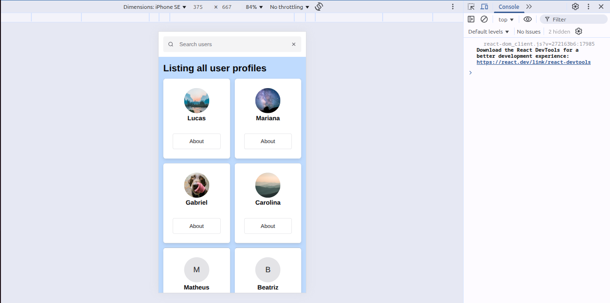
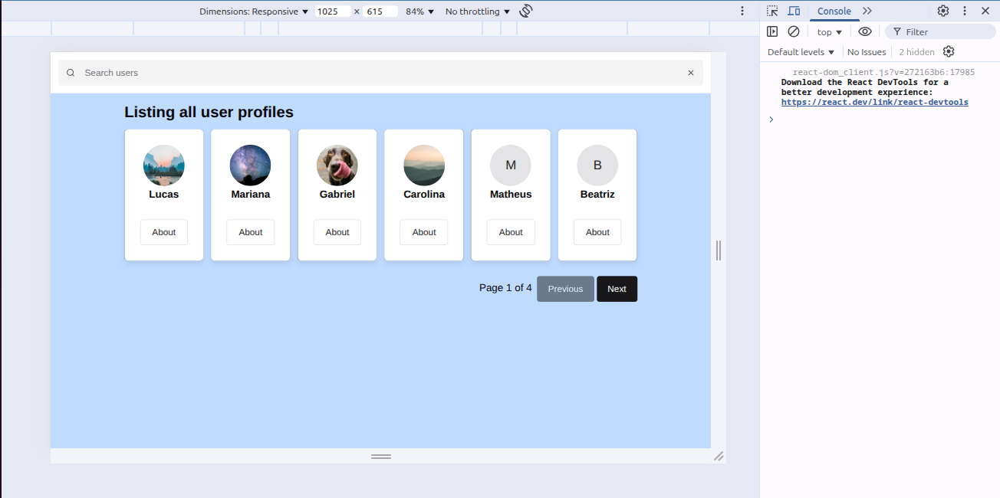
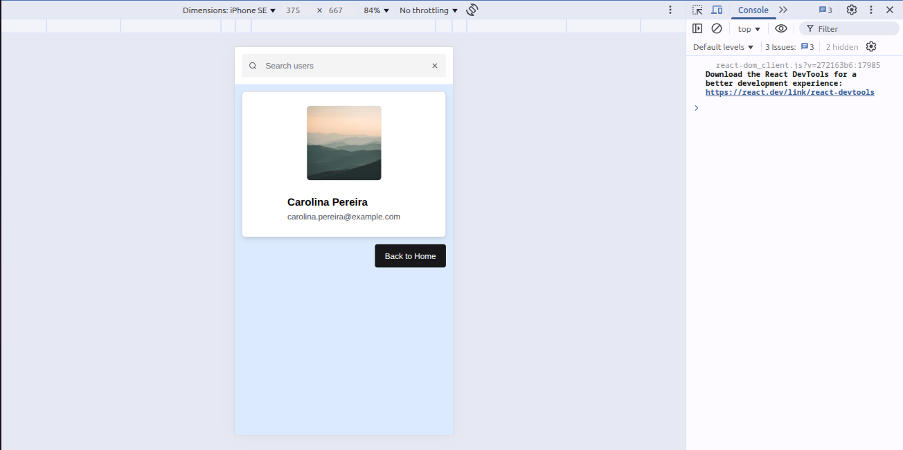
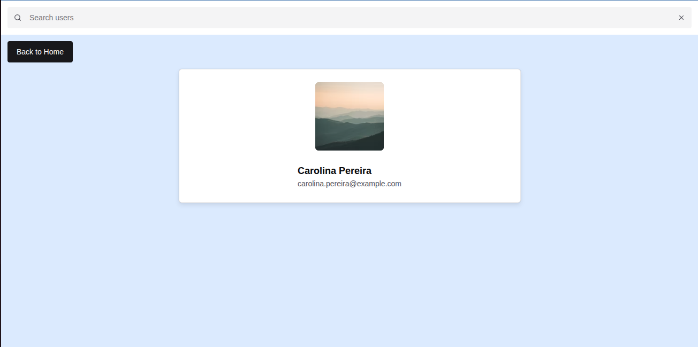
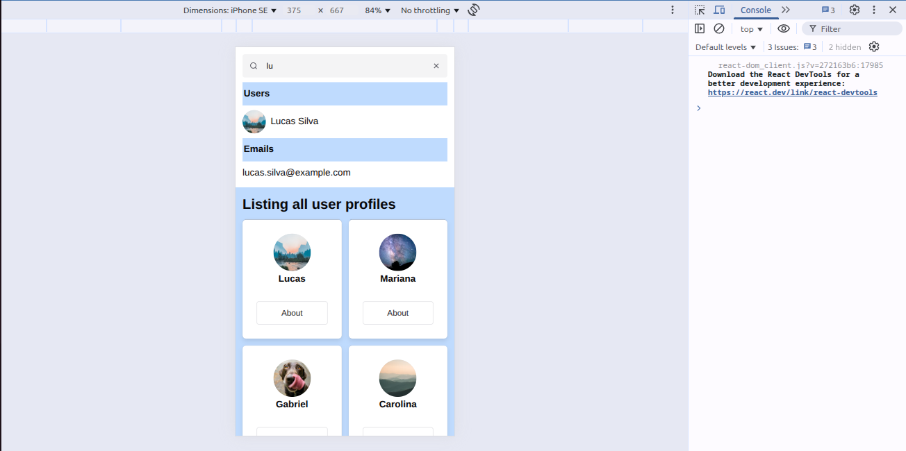
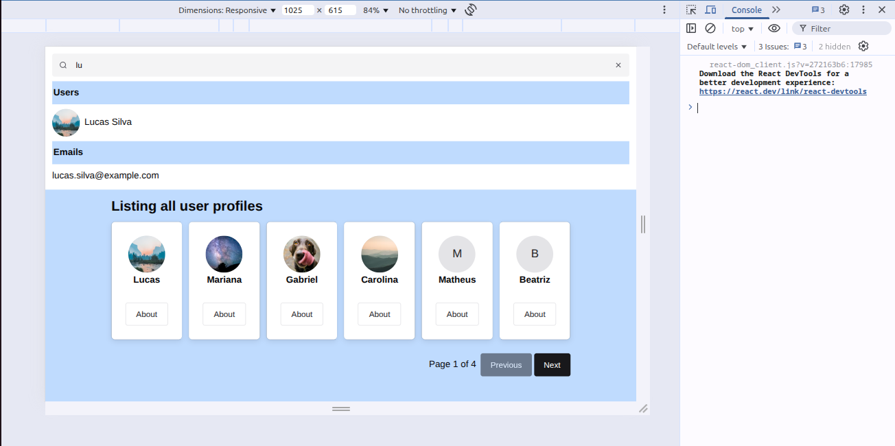

# Paciente360 — Desafio Técnico Frontend (React + TypeScript)

> Aplicação de listagem e visualização de detalhes de usuários consumindo API pública.

> Acesse o deploy deste projeto no seu navegador clicando [aqui](https://gilded-taffy-05c49d.netlify.app/)

## 📌 Descrição do Projeto
Lista todos os usuários cadastrados na página principal, exibindo 6 itens por página. É possível navegar entre as páginas para visualizar toda a lista de usuários. Ao clicar no botão "about", o usuário é redirecionado a uma nova página para mostrar todos os detalhes do usuário escolhido. Também é possível realizar uma busca por usuário e email.

## 🎯 Funcionalidades
- Listagem paginada de usuários (neste projeto são 6 usuários por página)
- Exibição de nome, e‑mail e avatar em cada card
- Exibe o indicador de carregamento enquanto faz o request da lista de usuários
- Apresenta uma tela de detalhes do usuário em rota separada
- O componente de pesquisa realiza um filtro de busca por nome e email (executado localmente)
- Responsividade mobile e desktop

## 🛠 Tecnologias Usadas
- NodeJS (versão 23.8.0)
- npm (versão 10.9.2)
- React (Vite)
- TypeScript
- Chakra UI
- React Router DOM
- Context API

## 🚀 Como rodar localmente
1. **Clone o repositório**  
   ```bash
   git clone https://github.com/caioarodrigues/PS-P360-JUL2025
   cd PS-P360-JUL2025
   npm install
   npm run dev

## ⏳ Tempo estimado investido
* Dia 1 (3h) - Definição de uma estrutura para o projeto e base de dados local para os usuários
* Dia 2 (0h) - `❌`
* Dia 3 (1h30m)- Criação do header da aplicação e refinamento do gerenciamento de contexto
* Dia 4 (2h)- Refinamento da responsividade e componentes de listagem e troca de páginas
* Dia 5 (4h)- Mais refinamento na estilização da aplicação e modularização dos componentes

`Total de tempo estimado:` 10h30min

## 🔎 Observações

1. Não foi possível implementar a suíte de testes com o Jest, pois o mesmo estava apresentando várias incompatibilidades com o Vite.

2. O ContextAPI foi usado para gerenciar as variáveis de estado.


## 🖼️ Prints do funcionamento da aplicação para mobile e desktop

`Página inicial`

Exibe uma lista agrupada a cada 6 usuários. 




`Detalhes do usuário`

Mostra todos os atributos de um usuário selecionado.




`Realizando buscas`

Ao digitar no componente de input, é realizada uma busca simultânea entre os nomes e emails dos usuários armazenados localmente. Ao clicar no nome ou foto listado no resultado, o usuário é direcionado para a página de detalhes. 



